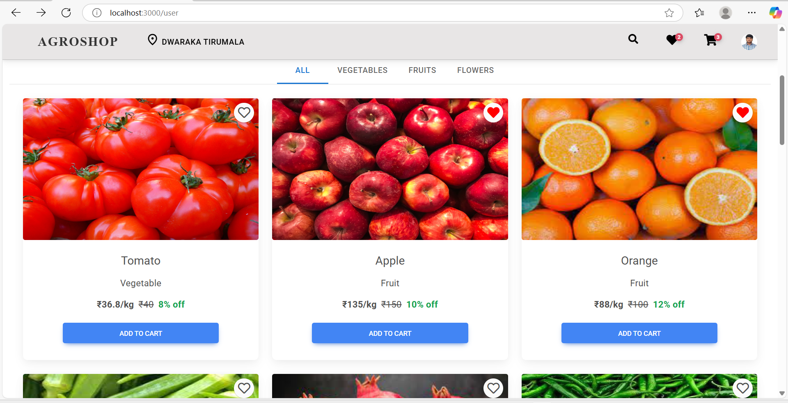
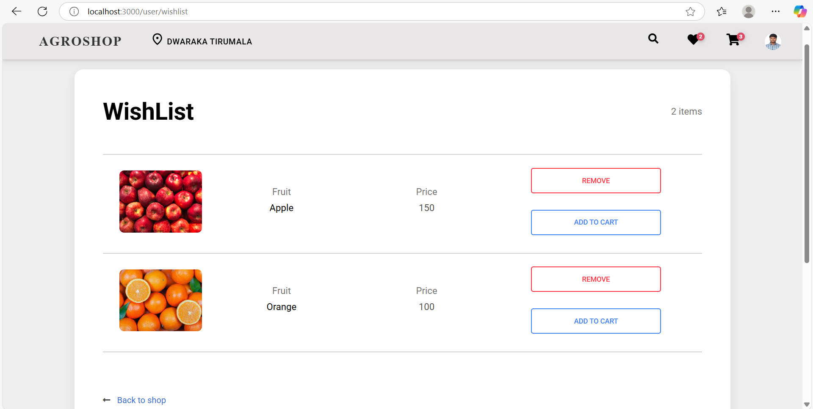
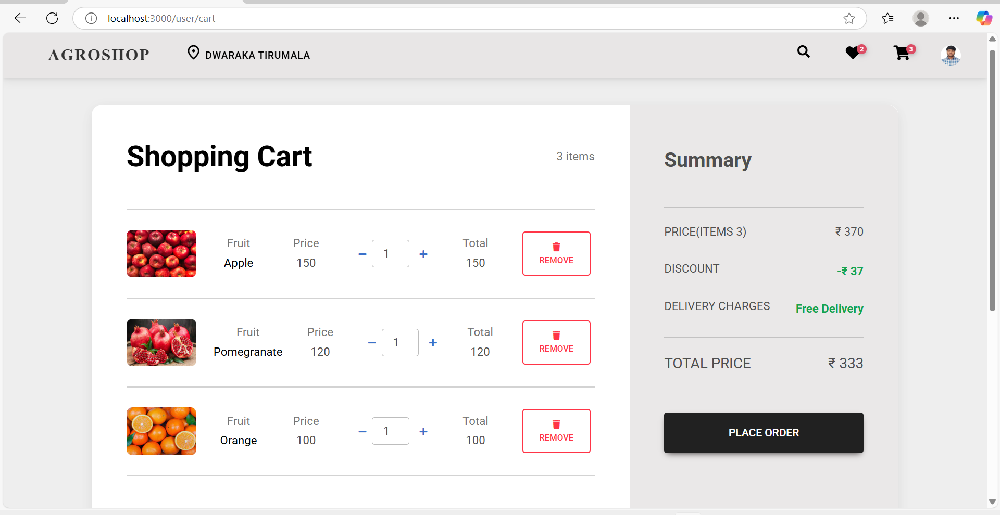
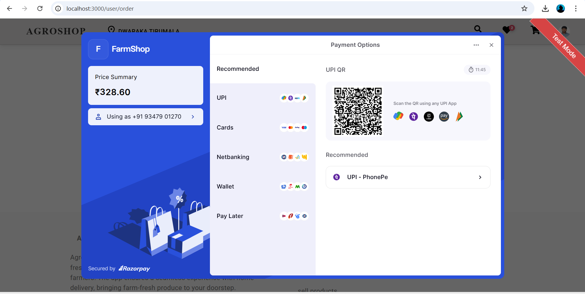

# 🌾 AgroShop App

AgroShop is a platform where users can buy organic vegetables, fruits, and flowers directly from farmers. It supports user authentication, cart management, and delivery integration.

## 🚀 Features
- Farmer & User Registration/Login
- Product Listings with Categories
- Cart and Checkout System
- Payment gateway Integration 
  
## 🛠️ Built With
- Python, Django Rest Framework
- React.js
- MongoDB
  
## 🖼️ Screenshots

### 🔐 Login Page


### 🏠 Home Page


### 💖 Wishlist Page


### 🛒 Cart Page


### 🛒 Payment Page



## 📦 Installation

```bash
git clone https://github.com/yourusername/agroshop-app.git
cd agroshop-app
pip install -r requirements.txt
uvicorn main:app --reload
